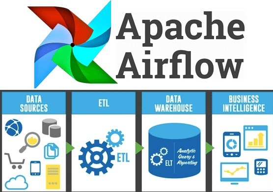

# Laboratorio 5 - Modelado multidimensional y ETL

## Objetivos

- Entender las características y pasos de un proceso de ETL
- Definir un proceso de ETL para crear y poblar modelos dimensionales de tipo ROLAP
- Familiarizarse con Airflow, una herramienta que administra, estructura y organiza pipelines de datos utilizando gráficos acíclicos dirigidos (DAG). 
- Empezar a trabajar con un datalake. Familiarizarse con Hadoop Distributed File System (HDFS). Un sistema de archivos distribuido que proporciona acceso de alto rendimiento a datos guardados en clusteres de  Hadoop. 


## Herramientas

-  PosgreSQL. Sistema de base de datos relacional en que se persistirá el modelo multidimensional.
    - Pueden encontrar los instaladores en este enlace: https://www.postgresql.org/download/
-  Apache Airflow. En la máquina virtual asignada se encuentran los archivos necesarios para poder ejecutarlo.
    - Documentación de Airflow: https://airflow.apache.org/docs/
    - Ejemplos de DAGS que les pueden ser últiles: https://github.com/apache/airflow/tree/main/airflow/example_dags 
- Apache Hadoop. Una herramienta que proporciona un marco de software para el almacenamiento distribuido y el procesamiento de grandes cantidades de datos.
    - HDFS users guide: https://hadoop.apache.org/docs/stable/hadoop-project-dist/hadoop-hdfs/HdfsUserGuide.html 
-  Visual Studio Code. En dicha herramienta se programarán las diferentes tareas que componen a los DAGS de airflow.
    - Documentación: https://code.visualstudio.com/docs
-  Docker Desktop. Herramienta que permitirá empaquetar Airflow y ejecutar su contenedor.
    - Docker desktop user manual: https://docs.docker.com/desktop/windows/


## Preparación (Antes de la sesión del laboratorio) 

1. Creación base de datos Postgres
    - Conectarse a la máquina virtual Windows que le fue asignada en la sección unificada del curso, para tener acceso al software requerido en el laboratorio
     - Crear una base de datos PosgreSQL en la máquina virtual provista. Este paso es equivale a crear un DataMart.
        * Ejecutar pgAdmin para crear un usuario y una base de datos. La contraseña maestra es: admin
        
            > a.	Crear un login para el curso llamado GrupoXBI (la X corresponde al número de su grupo), con la clave que deseen. El usuario debe tener privilegios de login y de create databases.
                
            
            
            
            
            > b.	Crear la base de datos llamada WWWIDWGrupoX con owner GrupoXBI
            
            
        
2. Entender el funcionamiento de Airflow

    La herramienta Apache Airflow ya se encuentra desplegada en las máquinas virtuales por medio de un contenedor, para su ejecución simplemente abran el programa "Docker Desktop" que se encuentra en el escritorio. Para entender como funciona Airflow pueden revisar la carpeta "Airflow-Docker".
    
    En ella se encuentran definidos varios directorios:
    - ./dags - Aquí van sus colecciones de tareas en airflow.
    - ./data - Aquí van los archivos los datos a usar
    - ./logs - Contiene registros de la ejecución de tareas.
    - ./models - Aquí van modelos .joblib o .pkl, en este laboratorio no será necesario usar esta carpeta.
    - ./utils - Aquí van a almacenar las funciones que son llamadas por cada tarea de Airflow.
    
    El servidor web para poder usuar la herramienta de Airflow está disponible en http://localhost:8080. 


## Perfilamiento de los datos 

En este laboratorio se utilizarán archivos CSV que corresponden a los datos de diferentes dimensiones en un modelo multidimensional. Estos provienen de una base de datos SQLServer, por lo que es importante realizar un perfilamiento de los archivos recibidos para preparar los datos que puedan generar conflictos en el proceso. 

En este caso los archivos hacen parte de un repositorio centralizado. Estos se encuentran en un sistema de archivos distribuidos de un cluster Hadoop (HDFS). Este cluster está desplegado sobre los servidores de la universidad y su arquitectura permite tener un acceso escalable, rápido y ordenado sobre los datos desde cualquier equipo de la organización.

En las máquinas virtuales pueden visitar la siguiente URL para revisar y descargar los archivos csv de este laboratorio: 
- http://bigdata-cluster4-01.virtual.uniandes.edu.co:50070/explorer.html#/user/monitorbi/datalakeBI

Estructura del datalake:


De igual manera tienen un link directo para descargar cada uno de los archivos: 
```
http://bigdata-cluster4-01.virtual.uniandes.edu.co:50070/webhdfs/v1/user/monitorbi/datalakeBI/nombre_archivo?op=OPEN&user.name=cursobiXX
```

Para poder hacer la descarga por medio del link deben cambiar:
- "nombre_archivo" por el archivo que en cuestión que desean descargar
- "XX" por el número de su grupo

Ejemplo: 
```
http://bigdata-cluster4-01.virtual.uniandes.edu.co:50070/webhdfs/v1/user/monitorbi/datalakeBI/dimension_city.csv?op=OPEN&user.name=cursobi01
```


## Caso de estudio

WWI (Wide World Importers) es una empresa encargada de realizar importaciones y venderlas a diferentes clientes en diferentes ciudades de Estados Unidos. Actualmente, la empresa se encuentra buscando servicios de consultoría de BI puesto que desean optimizar sus ganancias, pues consideran que algunos de sus productos no están generando las ganancias que deberían. También, están interesados en saber si hay otros factores que le impiden optimizar sus ganancias. Dado lo anterior, WWI lo contrata a usted para que realice una consultoría de BI, en particular en esta fase, para la creación de la base de datos, la carga de datos y unas consultas iniciales que permitan validar el proceso previo. En esta ocasión quiere que el trabajo lo realicen en grupos de máximo 3 estudiantes, con el fin de que comprenda bien el proceso y pueda darle sugerencias en procesos futuros de ETL. 
Este caso es creado a partir de la información descrita en [esta página](https://learn.microsoft.com/en-us/sql/samples/wide-world-importers-what-is?view=sql-server-ver16).


Para esta etapa de la consultoría, la empresa requiere que usted implemente un proceso ETL que le permita extraer los datos de órdenes desde unos archivos CSV y almacenarlos en un modelo dimensional tal que les permita realizar análisis para mejorar entre otros elementos, su eficiencia operativa. 
A continuación, se presenta el modelo multidimensional que se desea obtener: 


Es así, como al final de este laboratorio se espera contar con un proceso ETL que lea los archivos CSV provenientes de la base de datos del cliente (Hadoop) y realice todo el proceso necesario para limpiarlos y cargarlos en una base de datos PostgreSQL, al modelo dimensional. 

<p align="right" width="100%">
    

</p>

En la siguiente sección, se presenta un tutorial de uso de Airflow para la carga de datos provenientes de un archivo csv correspondientes a las dimensiones del modelo multidimensional. 
Los pasos presentados en el tutorial deben ser repetidos para construir y cargar cada una de las dimensiones y la tabla de hechos del modelo dimensional recomendado. 

Se debe tener en cuenta que al final del tutorial hay una serie de preguntas, las cuales deben ser respondidas en el informe que se entrega asociado a este laboratorio. 


## Tutorial implementación del proceso ETL


1. Creación de una conexión postgres en airflow: 
    
    En la interfaz de airflow, deben ir a la pestaña Admin -> Connections y crear la conexión que tendrá Airflow con la base de datos Postgres de la VM.
    
    ```
    Connection Id: postgres_localhost
    Connection Type: Postgres
    Host: host.docker.internal (esta es la forma de acceder a localhost desde docker)
    Schema: WWWIDWGrupoX (base de datos creada en pgAdmin)
    Login: GrupoXBI (usuario creado en pgAdmin)
    Password: (contraseña del usuario)
    Port: 5432
    ```
    
    
    

2.	Crear los archivos de utilidad que utilizarán los DAGS en Airflow. En la carpeta dags del contenedor, deben crear un directorio llamado "utils" en cual se definirán 3 archivos:

    - crear_tablas.py - este archivo contendrá el script de creación de tablas del modelo multidimensional
    
    ```
    def crear_tablas():
        return """
        
            CREATE TABLE IF NOT EXISTS date_table(
                Date_key DATE PRIMARY KEY,
                Day_Number INT,
                Day_val INT,
                Month_val VARCHAR(20),
                Short_Month VARCHAR(10),
                Calendar_Month_Number INT,
                Calendar_Year INT,
                Fiscal_Month_Number INT,
                Fiscal_Year INT
            );
    
            CREATE TABLE IF NOT EXISTS city(
                City_Key INT PRIMARY KEY,
                City VARCHAR(150),
                State_Province VARCHAR(150),
                Country VARCHAR(150),
                Continent VARCHAR(150),
                Sales_Territory VARCHAR(150),
                Region VARCHAR(150),
                Subregion VARCHAR(150),
                Latest_Recorded_Population INT
            );
    
            CREATE TABLE IF NOT EXISTS customer(
                Customer_Key INT PRIMARY KEY,
                Customer VARCHAR(150),
                Bill_To_Customer VARCHAR(150),
                Category VARCHAR(150),
                Buying_Group VARCHAR(150),
                Primary_Contact VARCHAR(150),
                Postal_Code INT
            );
    
            CREATE TABLE IF NOT EXISTS employee(
                Employee_Key INT PRIMARY KEY,
                Employee VARCHAR(150),
                Preferred_Name VARCHAR(150),
                Is_Salesperson BOOLEAN
            );
    
            CREATE TABLE IF NOT EXISTS stockitem(
                Stock_Item_Key INT PRIMARY KEY,
                Stock_Item VARCHAR(200),
                Color VARCHAR(50),
                Selling_Package VARCHAR(50),
                Buying_Package VARCHAR(50),
                Brand VARCHAR(50),
                Size_val VARCHAR(50),
                Lead_Time_Days INT,
                Quantity_Per_Outer INT,
                Is_Chiller_Stock BOOLEAN,
                Tax_Rate DECIMAL,
                Unit_Price DECIMAL,
                Recommended_Retail_Price DECIMAL,
                Typical_Weight_Per_Unit DECIMAL
            );
    
    
            CREATE TABLE IF NOT EXISTS fact_order(
                Order_Key INT PRIMARY KEY,
                City_Key INT REFERENCES city (city_key),
                Customer_Key INT REFERENCES customer (customer_key),
                Stock_Item_Key INT REFERENCES stockitem (stock_item_key),
                Order_Date_Key DATE REFERENCES date_table (date_key),
                Picked_Date_Key DATE REFERENCES date_table (date_key),
                Salesperson_Key INT REFERENCES employee (employee_key),
                Picker_Key INT REFERENCES employee (employee_key),
                Package VARCHAR(50),
                Quantity INT,
                Unit_Price DECIMAL,
                Tax_Rate DECIMAL,
                Total_Excluding_Tax DECIMAL,
                Tax_Amount DECIMAL,
                Total_Including_Tax DECIMAL
            );
        """
    ```
    
    - file_util.py - este archivo tendrá las funciones de escritura, lectura y procesamiento de los datos en formato csv
    
    ```
    import pandas as pd
    import os
    
    def cargar_datos(name):
        df = pd.read_csv("/opt/airflow/data/" + name + ".csv", sep=',', encoding = 'latin1', index_col=False)
        return df
    
    def guardar_datos(df, nombre):
        df.to_csv("/opt/airflow/data/" + nombre + ".csv" , encoding = 'latin1', sep=',', index=False)  
        
        
    def procesar_datos():
        
        ## Dimension city
        city = pd.read_csv("http://bigdata-cluster4-01.virtual.uniandes.edu.co:50070/webhdfs/v1/user/monitorbi/datalakeBI/dimension_city.csv?op=OPEN&user.name=cursobiXX", sep=',', encoding = 'latin1', index_col=False) # recuerden cambiar XX por el número de su grupo
        # To Do: Limpiar los datos y guardarlos
        guardar_datos(city, "dimension_city")
    
        ## Dimension Customer
        customer = pd.read_csv("http://bigdata-cluster4-01.virtual.uniandes.edu.co:50070/webhdfs/v1/user/monitorbi/datalakeBI/dimension_customer.csv?op=OPEN&user.name=cursobiXX", sep=',', encoding = 'latin1', index_col=False)
        # To Do: Limpiar los datos y guardarlos
        guardar_datos(customer, "dimension_customer")
        
        ## Dimension Date
        date = pd.read_csv("http://bigdata-cluster4-01.virtual.uniandes.edu.co:50070/webhdfs/v1/user/monitorbi/datalakeBI/dimension_date.csv?op=OPEN&user.name=cursobiXX", sep=',', encoding = 'latin1', index_col=False)
        # To Do: Limpiar los datos y guardarlos
        guardar_datos(date, "dimension_date")
    
        ## Dimension Employee
        employee = pd.read_csv("http://bigdata-cluster4-01.virtual.uniandes.edu.co:50070/webhdfs/v1/user/monitorbi/datalakeBI/dimension_employee.csv?op=OPEN&user.name=cursobiXX", sep=',', encoding = 'latin1', index_col=False)
        # To Do: Limpiar los datos y guardarlos
        guardar_datos(employee, "dimension_employee")
    
        ## Dimension Stock item
        stock_item = pd.read_csv("http://bigdata-cluster4-01.virtual.uniandes.edu.co:50070/webhdfs/v1/user/monitorbi/datalakeBI/dimension_stock_item.csv?op=OPEN&user.name=cursobiXX", sep=',', encoding = 'latin1', index_col=False)
        # To Do: Limpiar los datos y guardarlos
        guardar_datos(stock_item, "dimension_stock_item")
        
        ## Fact Table
        fact_order = pd.read_csv("http://bigdata-cluster4-01.virtual.uniandes.edu.co:50070/webhdfs/v1/user/monitorbi/datalakeBI/fact_order.csv?op=OPEN&user.name=cursobiXX", sep=',', encoding = 'latin1', index_col=False)
        # To Do: Limpiar los datos y guardarlos
        guardar_datos(fact_order, "fact_order")
    
    ```
    
    - insert_queries.py - este archivo tendrá funciones que transformarán el contenido de archivos csv a queries de inserción en SQL. Se deja como ejemplo la dimensión city, las demás funciones de inserción deben ser implementadas por ustedes.
    
    ```
    from utils.file_util import cargar_datos

    # city insertion
    def insert_query_city(**kwargs):
        
        insert = f"INSERT INTO city (City_Key,City,State_Province,Country,Continent,Sales_Territory,Region,Subregion,Latest_Recorded_Population) VALUES "
        insertQuery = ""
        # Es necesario colocar este try porque airflow comprueba el funcionamiento de las tareas en paralelo y al correr el DAG no existe el archivo dimension_city. Deben colocar try y except en todas las funciones de insert
        try:
            dataframe =cargar_datos(kwargs['csv_path'])
            for index, row in dataframe.iterrows():
                insertQuery += insert + f"({row.City_Key},\'{row.City}\',\'{row.State_Province}\',\'{row.Country}\',\'{row.Continent}\',\'{row.Sales_Territory}\',\'{row.Region}\',\'{row.Subregion}\',{row.Latest_Recorded_Population});\n"
            return insertQuery
        except:
            return ""
    
    # customer insertion
    def insert_query_customer(**kwargs):
        # To Do
    
    # date insertion
    def insert_query_date(**kwargs):
        # To Do: recuerden que tratar con variables de tipo "DATE" en sql se hace uso de la instrucción TO_DATE. ejemplo: TO_DATE('31-12-2022','DD-MM-YYYY')
    
    # employee insertion
    def insert_query_employee(**kwargs):
        # To Do
    
    # stock item insertion
    def insert_query_stock(**kwargs):
        # To Do
        
    # fact order insert
    def insert_query_fact_order(**kwargs):
        # To Do
        
    ```
 

3.	Implementar el DAG de ETL

    Apache Airflow utiliza data pipelines o flujos de trabajo para realizar funciones para consumo ya sea por aplicaciones de inteligencia de negocios o ciencia de datos. Para ello utiliza DAGS (Directed Acyclic Graph). 
    Estos son una colección de todas las tareas que se desean ejecutar, organizadas de una manera que refleja sus relaciones y dependencias. 
    
    En este caso crearemos un DAG que consta de 4 pasos, 3 ellos utilizarán operador de Airflow llamado "PostgresOperator" el cual es el encargado de manejar conexiones y procesos relacionados con bases de datos PostgreSQL. El DAG restante hace uso del operador PythonOperator el cual se encarga de ejecutar llamadas a código Python.
    
    1. Leer, procesar los datos y guardarlos.
    2. Crear tablas en la base de datos.
    3. Poblar tablas de dimensiones. Como la inserción de cada una de estas dimensiones es un proceso estrechamente relacionado, agruparemos todas estas tareas en un TaskGroup de Airflow. 
    4. Poblar tabla de hechos. Una vez terminada la inserción de las dimensiones la tabla de hechos debe guardarse en Postgres.
        
    A continuación se muestra el achivo "ETL.py" que contiene el codigo correspondiente a la implementación del DAG. Este archivo debe crearse en la carpeta dags:
    
    ```
    # Utilidades de airflow
    from airflow.models import DAG
    from airflow.providers.postgres.operators.postgres import PostgresOperator
    from airflow.operators.python_operator import PythonOperator
    from airflow.utils.task_group import TaskGroup

    # Utilidades de python
    from datetime  import datetime

    # Funciones ETL
    from utils.crear_tablas import crear_tablas
    from utils.file_util import procesar_datos
    from utils.insert_queries import *

    default_args= {
        'owner': 'Estudiante',
        'email_on_failure': False,
        'email': ['estudiante@uniandes.edu.co'],
        'start_date': datetime(2022, 5, 5) # inicio de ejecución
    }

    with DAG(
        "ETL",
        description='ETL',
        schedule_interval='@daily', # ejecución diaría del DAG
        default_args=default_args, 
        catchup=False) as dag:

        # task: 1 - preprocesamiento
        preprocesamiento = PythonOperator(
            task_id='preprocesamiento',
            python_callable=procesar_datos
        )

        # task: 2 crear las tablas en la base de datos postgres
        crear_tablas_db = PostgresOperator(
        task_id="crear_tablas_en_postgres",
        postgres_conn_id="postgres_localhost", # Nótese que es el mismo ID definido en la conexión Postgres de la interfaz de Airflow
        sql= crear_tablas()
        )

        # task: 3 poblar las tablas de dimensiones en la base de datos
        with TaskGroup('poblar_tablas') as poblar_tablas_dimensiones:
    
            # task: 3.1 poblar tabla city
            poblar_city = PostgresOperator(
                task_id="poblar_city",
                postgres_conn_id='postgres_localhost',
                sql=insert_query_city(csv_path = "dimension_city")
            )
    
            # task: 3.2 poblar tabla customer
            poblar_customer = PostgresOperator(
                task_id="poblar_customer",
                postgres_conn_id='postgres_localhost',
                sql=insert_query_customer(csv_path ="dimension_customer")
            )
    
            # task: 3.3 poblar tabla date
            poblar_date = PostgresOperator(
                task_id="poblar_date",
                postgres_conn_id='postgres_localhost',
                sql=insert_query_date(csv_path = "dimension_date")
            )
    
            # task: 3.4 poblar tabla employee
            poblar_employee = PostgresOperator(
                task_id="poblar_employee",
                postgres_conn_id='postgres_localhost',
                sql=insert_query_employee(csv_path = "dimension_employee")
            )
    
            # task: 3.5 poblar tabla stock item
            poblar_stock_item = PostgresOperator(
                task_id="poblar_stock_item",
                postgres_conn_id='postgres_localhost',
                sql=insert_query_stock(csv_path = "dimension_stock_item")
            )


        # task: 4 poblar la tabla de hechos
        poblar_fact_order = PostgresOperator(
                task_id="construir_tabla_de_hechos",
                postgres_conn_id='postgres_localhost',
                sql=insert_query_fact_order(csv_path = "fact_order")
        )
    
        # flujo de ejecución de las tareas  
        preprocesamiento >> crear_tablas_db >> poblar_tablas_dimensiones >> poblar_fact_order
    ```
    
    Una vez finalizado este proceso de implementación. En la interfaz de airflow debería poder verse el grafo de ejecución de la siguiente manera:
    
    
    
    Para correr el DAG creado deben oprimir el botón trigger DAG que se encuentra en la interfaz de Airflow:
    
    
    
    Si no hay ningún error el arbol de ejecución debería verse de la siguiente manera:
    
    
 

4.	Actividades
    - Completar el proceso de ETL, limpiando los datos y creando las respectivas sentencias de inserción sobre los diferentes archivos csv.
    - Corregir cualquier error que puedan tener durante el proceso, documentar aquellos errores que más se les dificultaron solucionar.
    - Cada uno de los pasos de este tutorial, debe ser descrito y respaldado por capturas de pantalla pertinentes.
    - Finalmente, realizar consultas sobre la base de datos para garantizar que la información fue cargada. De igual manera deben adjuntar capturas de pantalla sobre las consultas realizadas para comprobar que se cargó correcta y completamente la información.
    

5. Preguntas
    > - Explique a fondo los siguientes conceptos de airflow: Task, Operator, DAG. 
    > - ¿Por qué para la columna de día se utiliza el nombre “day_val” y no “day”?
    > - ¿De dónde se obtiene la información sobre las columnas que hay que crear en la tabla?
    > - ¿Por qué es necesario un flujo de ejecución de las tareas en Airflow?
    > - ¿Qué ajustes habría que hacer a este  proceso de ETL si se trata de un ETL incremental, donde previamente hay datos cargados en la bodega de datos?
    > - ¿Al revisar lo entregado por el grupo previo de consultores, se evidencia que no se está trabajando de forma apropiada con las llaves primarias, ya que se tienen las del sistema transaccional como PK, es así como se decide mantener esas llaves y renombrarlas con el sufijo _T y crear las propias de la bodega de datos con el sufijo _DWH. Estas últimas son consecutivos. Qué se debe hacer para que este cambio sea efectivo? muestre un ejemplo para una dimensión y su efecto en la tabla de hechos?
    > - ¿A nivel de la dimensión Fecha, se detecta que la llave primaria no es un entero que represente la fecha (AAAAMMDD), si no un atributo de tipo DATE, cómo corregirían este error?


## Instrucciones de Entrega
- El laboratorio se entrega en grupos de máximo 3 estudiantes
- Recuerde hacer la entrega por la sección unificada en Bloque Neón, antes del domingo 20 de noviembre a las 23:59.   
  Este será el único medio por el cual se recibirán entregas.

## Entregables

- Diagrama de alto nivel describiendo el proceso de ETL y plantilla del diseño del ETL. Apoyarse en las lecturas del curso, donde está descrito en detalle este punto. Utilice [este archivo excel](img/PlantillaDiseñoETL.xlsx) para realizar este paso.
- Documentación de los pasos realizados en el laboratorio. 
- Archivos ".py" que desarrollaron en este laboratorio. 
- Capturas de pantalla del árbol y grafo de ejecución de Airflow. Mostrar en la captura la base de datos Posgres para comprobrar que se trata de su grupo.
- Setencias sql utilizadas para consultar la información de dimensiones y tablas de hecho; mostrar los resultados de la ejecución de las consultas.
- Respuestas a las preguntas planteadas.

## Rúbrica de Calificación

A continuación se encuentra la rúbrica de calificación.

| Concepto | Porcentaje |
|:---:|:---:|
| Diagrama de alto nivel describiendo el proceso de ETL y plantilla del diseño del ETL| 10% |
| Documentación del proceso y las transformaciones realizadas en Airflow  | 25% |
| Preprocesamiento en Airflow | 15% |
| Crear y poblar tablas de las diferentes dimensiones  | 10% |
| Poblar tabla de hechos  | 20% |
| Respuestas a las preguntas del laboratorio | 15% |
| Archivos ".py" que desarrollaron en este laboratorio | 5% |


## Sugerencias

- Es posible que durante el desarrollo del laboratorio ocurran varios errores de ejecución del DAG de ETL. En la carpeta logs puede consultar a fondo dichos errores. Tambien, en el arbol de ejecución de la interfaz web pueden darle clic a la actividad que les está fallando y darle al botón "View Log". 
- Si tiene algún error en el despliegue de Airflow siga los siguientes pasos: En Docker Desktop detenga el contenedor de Airflow y borrelo; asimismo, borre las imagenes y volumenes, finalmente reinicie la aplicación, borre las carpetas generadas en Docker-Airflow y vuelva a realizar el proceso de despliegue.
- Es recomendable que para el preprocesamiento utilice primero un Notebook de Jupyter. Una vez compruebe que hizo una correcta limpieza, puede transladar el código escrito a la función "procesar_datos()" de Airflow.

## Referencias
- https://airflow.apache.org/
- https://airflow.apache.org/docs/
- https://docs.docker.com/desktop/windows/
- https://github.com/apache/airflow/tree/main/airflow/example_dags
- https://hadoop.apache.org/docs/stable/
- https://www.postgresql.org/docs/
- https://docs.microsoft.com/es-es/sql/samples/wide-world-importers-what-is?view=sql-server-ver15
- [3] Capítulo 20 (desde pág. 512 hasta pág. 520). - [3] KIMBALL, Ralph, ROSS, Margy. “The Data Warehouse Toolkit: the definitive guide to dimensional modeling".  Third Edition.  John Wiley & Sons, Inc, 2013.
- Opc. [6] Capítulo 11 (págs. 464-472) - [6] KIMBALL, Ralph, ROSS, Margy, BECKER, Bob, MUNDY Joy, and THORNTHWAITE, Warren. "The Kimball Group Reader: Relentlessly Practical Tools for Data Warehousing and Business Intelligence Remastered Collection". Wiley, 2016 
